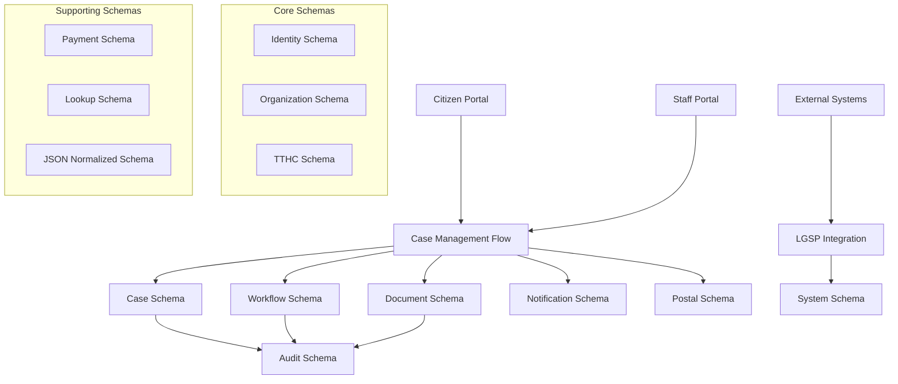

# Data Flow Documentation - Complete System Integration

## OVERVIEW

This document maps the complete data flow between all schemas in the updated DVC v2 database design, including the new tables and their integration patterns. It shows how data moves through the system from citizen application submission to completion and beyond.

## SYSTEM ARCHITECTURE OVERVIEW



## PRIMARY DATA FLOWS

### 1. CITIZEN APPLICATION FLOW

#### 1.1 Application Submission (Citizen → System)

```sql
-- Flow: Citizen submits new application
-- 1. Identity verification/creation
INSERT INTO [identity].USER_PROFILE (Email, FullName, PhoneNumber, UserType)
VALUES ('citizen@email.com', 'Nguyen Van A', '0901234567', 'CITIZEN');

-- 2. Case creation
INSERT INTO [case].HOSO (SoHoSo, TTHCCode, NguoiNopHoSo, TinhTrangXuLy, NgayNop)
VALUES ('HS-2024-000001', 'TTHC001', @CitizenID, 'TIEP_NHAN', GETDATE());

-- 3. Workflow instance creation
INSERT INTO [workflow].WORKFLOW_INSTANCE (WorkflowDefinitionID, RelatedEntityType, RelatedEntityID, Status, InitiatedBy)
VALUES (@WorkflowDefID, 'HOSO', @HoSoID, 'RUNNING', @CitizenID);

-- 4. Document attachments
INSERT INTO [document].DOCUMENT (RelatedHoSoID, DocumentType, FileName, FilePath, CreatedBy)
VALUES (@HoSoID, 'GIAY_TO_TUY_THAN', 'cmnd.pdf', '/documents/2024/01/cmnd.pdf', @CitizenID);

-- 5. Initial status history
INSERT INTO [case].STATUS_HISTORY (HoSoID, FromStatus, ToStatus, ChangedBy, ChangeReason)
VALUES (@HoSoID, NULL, 'TIEP_NHAN', @CitizenID, 'Nộp hồ sơ trực tuyến');

-- 6. SLA tracking initiation
INSERT INTO [case].SLA_TRACKING (HoSoID, WorkflowInstanceID, SLAType, TargetEndTime, SLAStatus)
VALUES (@HoSoID, @WorkflowInstanceID, 'PROCESSING', DATEADD(DAY, 15, GETDATE()), 'ACTIVE');

-- 7. Notification generation
INSERT INTO [notification].NOTIFICATION_QUEUE (MessageType, RecipientType, RecipientID, Subject, Content, RelatedEntityType, RelatedEntityID)
VALUES ('EMAIL', 'User', @CitizenID, 'Xác nhận tiếp nhận hồ sơ', 'Hồ sơ của bạn đã được tiếp nhận...', 'HOSO', @HoSoID);

-- 8. Audit logging
INSERT INTO [audit].AUDIT_LOG (UserID, ActionType, ResourceType, ResourceID, ActionDescription)
VALUES (@CitizenID, 'CREATE', 'HOSO', @HoSoID, 'Citizen submitted new application');
```

### 1.2 Staff Assignment and Processing

```sql
-- Flow: System assigns case to staff for processing
-- 1. Workflow step creation
INSERT INTO [workflow].WORKFLOW_STEP_INSTANCE (WorkflowInstanceID, StepDefinitionID, Status, AssignedUserID, DueDate)
VALUES (@WorkflowInstanceID, @ReviewStepDefID, 'PENDING', @StaffUserID, DATEADD(DAY, 3, GETDATE()));

-- 2. Task assignment creation
INSERT INTO [case].TASK_ASSIGNMENT (HoSoID, WorkflowInstanceID, WorkflowStepInstanceID, TaskCode, AssignedUserID, DueDate, Status, Priority)
VALUES (@HoSoID, @WorkflowInstanceID, @StepInstanceID, 'REVIEW_DOCUMENTS', @StaffUserID, DATEADD(DAY, 3, GETDATE()), 'Assigned', 2);

-- 3. Task queue entry
INSERT INTO [case].TASK_QUEUE (TaskAssignmentID, QueueName, CurrentAssignedUserID, Priority, EnteredQueueAt)
VALUES (@TaskAssignmentID, 'DOCUMENT_REVIEW', @StaffUserID, 2, GETDATE());

-- 4. Status update
UPDATE [case].HOSO
SET TinhTrangXuLy = 'DANG_XU_LY', CanBoXuLy = @StaffUserID
WHERE HoSoID = @HoSoID;

-- 5. Status history
INSERT INTO [case].STATUS_HISTORY (HoSoID, FromStatus, ToStatus, ChangedBy, ChangeReason)
VALUES (@HoSoID, 'TIEP_NHAN', 'DANG_XU_LY', @StaffUserID, 'Phân công xử lý');

-- 6. SLA update
UPDATE [case].SLA_TRACKING
SET SLAStatus = 'IN_PROGRESS', AssignedUserID = @StaffUserID
WHERE HoSoID = @HoSoID AND IsActive = 1;

-- 7. Notification to staff
INSERT INTO [notification].NOTIFICATION_QUEUE (MessageType, RecipientType, RecipientID, Subject, Content, RelatedEntityType, RelatedEntityID)
VALUES ('IN_APP', 'User', @StaffUserID, 'Nhiệm vụ mới được phân công', 'Bạn có nhiệm vụ xử lý hồ sơ mới...', 'TASK_ASSIGNMENT', @TaskAssignmentID);
```

### 1.3 Document Processing and Approval Flow

```sql
-- Flow: Document review and approval process
-- 1. Document processing
UPDATE [document].DOCUMENT
SET ProcessingStatus = 'UNDER_REVIEW', ReviewedBy = @StaffUserID, ReviewStartTime = GETDATE()
WHERE DocumentID = @DocumentID;

-- 2. Digital signature requirement
INSERT INTO [document].DIGITAL_SIGNATURE (DocumentID, SignerUserID, SignatureStatus, RequiredBy, RequiredAt)
VALUES (@DocumentID, @SupervisorUserID, 'PENDING', @StaffUserID, GETDATE());

-- 3. Approval chain creation
INSERT INTO [case].APPROVAL_CHAIN (HoSoID, WorkflowInstanceID, ApproverUserID, ApprovalLevel, ApprovalType, Status)
VALUES (@HoSoID, @WorkflowInstanceID, @SupervisorUserID, 1, 'DOCUMENT_APPROVAL', 'PENDING');

-- 4. Task completion
UPDATE [case].TASK_ASSIGNMENT
SET Status = 'Completed', CompletedAt = GETDATE(), CompletedBy = @StaffUserID, CompletionNotes = 'Documents reviewed and approved'
WHERE AssignmentID = @TaskAssignmentID;

-- 5. Workflow step progression
UPDATE [workflow].WORKFLOW_STEP_INSTANCE
SET Status = 'COMPLETED', CompletedAt = GETDATE(), CompletedBy = @StaffUserID
WHERE StepInstanceID = @StepInstanceID;

-- 6. Next workflow step
INSERT INTO [workflow].WORKFLOW_STEP_INSTANCE (WorkflowInstanceID, StepDefinitionID, Status, AssignedUserID, DueDate)
VALUES (@WorkflowInstanceID, @ApprovalStepDefID, 'PENDING', @SupervisorUserID, DATEADD(DAY, 2, GETDATE()));
```

## SECONDARY DATA FLOWS

### 2. NOTIFICATION PROCESSING FLOW

```sql
-- Flow: Asynchronous notification processing
-- 1. Notification template application
UPDATE [notification].NOTIFICATION_QUEUE
SET
    Subject = REPLACE(nt.Subject, '{HoSoSo}', h.SoHoSo),
    Content = REPLACE(REPLACE(nt.BodyTemplate, '{CitizenName}', up.FullName), '{HoSoSo}', h.SoHoSo),
    TemplateID = nt.TemplateID,
    TemplateVersion = nt.Version
FROM [notification].NOTIFICATION_QUEUE nq
JOIN [case].HOSO h ON nq.RelatedEntityID = h.HoSoID
JOIN [identity].USER_PROFILE up ON nq.RecipientID = up.UserID
JOIN [notification].NOTIFICATION_TEMPLATES nt ON nt.TemplateCode = 'HOSO_STATUS_UPDATE'
WHERE nq.QueueID = @QueueID;

-- 2. User notification preferences
UPDATE [notification].NOTIFICATION_QUEUE
SET
    RecipientAddress = CASE
        WHEN MessageType = 'EMAIL' THEN np.PreferredEmail
        WHEN MessageType = 'SMS' THEN np.PreferredPhone
        ELSE RecipientAddress
    END
FROM [notification].NOTIFICATION_QUEUE nq
JOIN [notification].NOTIFICATION_PREFERENCES np ON nq.RecipientID = np.UserID
WHERE nq.QueueID = @QueueID AND np.IsActive = 1;

-- 3. Notification delivery
UPDATE [notification].NOTIFICATION_QUEUE
SET Status = 'Sent', SentAt = GETDATE(), ProviderMessageID = @ProviderMsgID
WHERE QueueID = @QueueID;

-- 4. Notification history
INSERT INTO [notification].NOTIFICATION_HISTORY (MessageID, TemplateID, RecipientUserID, NotificationType, Status, SentAt)
SELECT MessageID, TemplateID, RecipientID, MessageType, 'Sent', SentAt
FROM [notification].NOTIFICATION_QUEUE
WHERE QueueID = @QueueID;
```

### 3. POSTAL SERVICE INTEGRATION FLOW

```sql
-- Flow: Physical document delivery process
-- 1. Shipment creation after case completion
INSERT INTO [postal].SHIPMENT_TRACKING (
    HoSoID, TrackingNumber, ProviderID, ShipmentType, ShipmentStatus,
    SenderName, SenderPhone, SenderAddress,
    ReceiverName, ReceiverPhone, ReceiverAddress,
    PackageWeight, EstimatedDeliveryDate, CreatedBy
)
VALUES (
    @HoSoID, 'VNP' + FORMAT(GETDATE(), 'yyyyMMdd') + RIGHT('000' + CAST(@ShipmentID AS VARCHAR), 6),
    @VietnamPostProviderID, 'DOCUMENT_DELIVERY', 'CREATED',
    @OfficeName, @OfficePhone, @OfficeAddress,
    @CitizenName, @CitizenPhone, @CitizenAddress,
    0.5, DATEADD(DAY, 3, GETDATE()), @StaffUserID
);

-- 2. Document list for shipment
UPDATE [postal].SHIPMENT_TRACKING
SET DocumentList = (
    SELECT STRING_AGG(DocumentType + ':' + FileName, ';')
    FROM [document].DOCUMENT
    WHERE RelatedHoSoID = @HoSoID AND IsActive = 1
)
WHERE ShipmentID = @ShipmentID;

-- 3. Provider API integration
INSERT INTO [system].LGSP_SYNC_LOG (
    SyncType, EntityType, EntityID, SyncStartTime, SyncStatus,
    RequestPayload, SyncAttempts, CreatedBy
)
VALUES (
    'SHIPMENT_CREATE', 'SHIPMENT', @ShipmentID, GETDATE(), 'IN_PROGRESS',
    '{"shipment_id": "' + @TrackingNumber + '", "recipient": "' + @CitizenName + '"}',
    1, @StaffUserID
);

-- 4. Delivery confirmation processing
INSERT INTO [postal].DELIVERY_CONFIRMATION (
    ShipmentID, DeliveryStatus, DeliveredAt, ReceiverName,
    DeliveryMethod, DeliverySignature, CreatedBy
)
VALUES (
    @ShipmentID, 'DELIVERED', GETDATE(), @ActualReceiverName,
    'IN_PERSON', @SignatureData, @DeliveryPersonID
);
```

### 4. SLA MONITORING AND ESCALATION FLOW

```sql
-- Flow: Automated SLA monitoring and escalation
-- 1. SLA breach detection
UPDATE [case].SLA_TRACKING
SET
    SLAStatus = CASE
        WHEN GETDATE() > TargetEndTime THEN 'BREACHED'
        WHEN DATEDIFF(HOUR, GETDATE(), TargetEndTime) <= 24 THEN 'CRITICAL'
        WHEN DATEDIFF(HOUR, GETDATE(), TargetEndTime) <= 48 THEN 'WARNING'
        ELSE 'ACTIVE'
    END,
    IsBreached = CASE WHEN GETDATE() > TargetEndTime THEN 1 ELSE 0 END,
    BreachTime = CASE WHEN GETDATE() > TargetEndTime AND BreachTime IS NULL THEN GETDATE() ELSE BreachTime END,
    RemainingHours = DATEDIFF(HOUR, GETDATE(), TargetEndTime)
WHERE IsActive = 1;

-- 2. Escalation trigger
INSERT INTO [case].SLA_TRACKING (
    HoSoID, WorkflowInstanceID, SLAType, SLACategory,
    TargetEndTime, SLAStatus, EscalationLevel, EscalatedTo, EscalatedAt,
    EscalationReason, CreatedBy
)
SELECT
    HoSoID, WorkflowInstanceID, 'ESCALATION', 'AUTO_ESCALATION',
    DATEADD(DAY, 1, GETDATE()), 'ACTIVE', EscalationLevel + 1,
    up.ManagerID, GETDATE(), 'SLA breach - automatic escalation', @SystemUserID
FROM [case].SLA_TRACKING st
JOIN [case].HOSO h ON st.HoSoID = h.HoSoID
JOIN [identity].USER_PROFILE up ON h.CanBoXuLy = up.UserID
WHERE st.IsBreached = 1 AND st.EscalationLevel < 3;

-- 3. Escalation notification
INSERT INTO [notification].NOTIFICATION_QUEUE (
    MessageType, Channel, Priority, RecipientType, RecipientID,
    Subject, Content, RelatedEntityType, RelatedEntityID
)
SELECT
    'EMAIL', 'System', 1, 'User', EscalatedTo,
    'SLA Breach - Escalation Required: ' + h.SoHoSo,
    'Case ' + h.SoHoSo + ' has breached SLA and requires immediate attention.',
    'SLA_TRACKING', st.SLATrackingID
FROM [case].SLA_TRACKING st
JOIN [case].HOSO h ON st.HoSoID = h.HoSoID
WHERE st.EscalationLevel > 0 AND st.CreatedAt > DATEADD(MINUTE, -5, GETDATE());
```

## INTEGRATION DATA FLOWS

### 5. LGSP GOVERNMENT PLATFORM INTEGRATION

```sql
-- Flow: Synchronization with government systems
-- 1. Entity mapping for synchronization
INSERT INTO [system].LGSP_ENTITY_MAPPING (
    LocalEntityType, LocalEntityID, LGSPEntityType, LGSPEntityID,
    MappingType, IsActive, CreatedBy
)
VALUES (
    'HOSO', @HoSoID, 'APPLICATION', @LGSPApplicationID,
    'BIDIRECTIONAL', 1, @SystemUserID
);

-- 2. Field-level mapping
INSERT INTO [system].LGSP_FIELD_MAPPING (
    EntityMappingID, LocalFieldName, LGSPFieldName,
    TransformationRule, IsRequired, CreatedBy
)
VALUES
    (@MappingID, 'SoHoSo', 'application_number', NULL, 1, @SystemUserID),
    (@MappingID, 'TinhTrangXuLy', 'status', '{"mapping": {"TIEP_NHAN": "RECEIVED", "DANG_XU_LY": "PROCESSING"}}', 1, @SystemUserID);

-- 3. Synchronization execution
INSERT INTO [system].LGSP_SYNC_LOG (
    SyncType, EntityType, EntityID, SyncStartTime, SyncStatus,
    RequestPayload, ResponsePayload, SyncAttempts, CreatedBy
)
VALUES (
    'STATUS_UPDATE', 'HOSO', @HoSoID, GETDATE(), 'IN_PROGRESS',
    '{"application_id": "' + @LGSPApplicationID + '", "status": "PROCESSING"}',
    NULL, 1, @SystemUserID
);

-- 4. Fallback data caching
INSERT INTO [system].LGSP_CONFIGURATION (
    ConfigKey, ConfigValue, ConfigType, Environment,
    FallbackData, CacheData, CreatedBy
)
VALUES (
    'CITIZEN_DATA_' + @CitizenID, @CitizenDataJSON, 'CACHE', 'PRODUCTION',
    @FallbackDataJSON, @CachedDataJSON, @SystemUserID
);
```

### 6. CITIZEN FEEDBACK AND RATING FLOW

```sql
-- Flow: Citizen satisfaction and feedback processing
-- 1. Feedback submission
INSERT INTO [case].CITIZEN_FEEDBACK (
    HoSoID, CitizenID, FeedbackCode, FeedbackType, FeedbackChannel,
    OverallRating, ProcessEfficiencyRating, StaffServiceRating,
    Title, Content, PositiveAspects, ImprovementSuggestions,
    WouldRecommend, WouldUseAgain, MetExpectations,
    ServiceOfficeID, ProcessingTime, ExpectedTime
)
VALUES (
    @HoSoID, @CitizenID, 'FB-2024-' + FORMAT(@FeedbackID, '000000'),
    'COMPLETION', 'ONLINE', 5, 4, 5,
    'Excellent Service', 'Very satisfied with the quick processing...',
    'Quick processing, helpful staff', 'Maybe improve online form clarity',
    1, 1, 4, @OfficeID, 12.5, 15.0
);

-- 2. Sentiment analysis (AI processing)
UPDATE [case].CITIZEN_FEEDBACK
SET
    SentimentScore = @CalculatedSentiment,
    SentimentLabel = CASE
        WHEN @CalculatedSentiment > 0.6 THEN 'VERY_POSITIVE'
        WHEN @CalculatedSentiment > 0.2 THEN 'POSITIVE'
        WHEN @CalculatedSentiment > -0.2 THEN 'NEUTRAL'
        WHEN @CalculatedSentiment > -0.6 THEN 'NEGATIVE'
        ELSE 'VERY_NEGATIVE'
    END,
    KeyTopics = @ExtractedTopicsJSON,
    SatisfactionPrediction = @MLSatisfactionScore
WHERE FeedbackID = @FeedbackID;

-- 3. Aggregate service rating calculation
INSERT INTO [case].SERVICE_RATING (
    ServiceCode, ServiceName, ServiceOfficeID,
    RatingPeriodType, PeriodStartDate, PeriodEndDate,
    OverallRating, TotalFeedbacks, PositiveFeedbacks, NeutralFeedbacks, NegativeFeedbacks,
    RecommendationRate, ReturnRate, ExpectationsMet,
    AverageProcessingTime, AverageSentimentScore
)
SELECT
    t.MaTTHC, t.TenTTHC, @OfficeID,
    'MONTHLY', @MonthStart, @MonthEnd,
    AVG(CAST(cf.OverallRating AS DECIMAL(3,2))),
    COUNT(*),
    SUM(CASE WHEN cf.OverallRating >= 4 THEN 1 ELSE 0 END),
    SUM(CASE WHEN cf.OverallRating = 3 THEN 1 ELSE 0 END),
    SUM(CASE WHEN cf.OverallRating <= 2 THEN 1 ELSE 0 END),
    AVG(CASE WHEN cf.WouldRecommend = 1 THEN 100.0 ELSE 0.0 END),
    AVG(CASE WHEN cf.WouldUseAgain = 1 THEN 100.0 ELSE 0.0 END),
    AVG(CASE WHEN cf.MetExpectations >= 3 THEN 100.0 ELSE 0.0 END),
    AVG(cf.ProcessingTime),
    AVG(cf.SentimentScore)
FROM [case].CITIZEN_FEEDBACK cf
JOIN [case].HOSO h ON cf.HoSoID = h.HoSoID
JOIN [tthc].THU_TUC t ON h.TTHCCode = t.MaTTHC
WHERE cf.SubmittedAt BETWEEN @MonthStart AND @MonthEnd
AND cf.ServiceOfficeID = @OfficeID
GROUP BY t.MaTTHC, t.TenTTHC;
```

## JSON NORMALIZED DATA FLOWS

### 7. JSON TO RELATIONAL MIGRATION FLOW

```sql
-- Flow: Migrating from JSON columns to normalized tables
-- 1. Address normalization
INSERT INTO [json_normalized].ADDRESS_COMPONENTS (
    SourceTable, SourceID, AddressType,
    ProvinceCode, ProvinceName, DistrictCode, DistrictName,
    WardCode, WardName, StreetNumber, StreetName, FullAddress
)
SELECT
    'SHIPMENT_TRACKING', st.ShipmentID, 'SENDER',
    JSON_VALUE(st.SenderAddress, '$.provinceCode'),
    JSON_VALUE(st.SenderAddress, '$.provinceName'),
    JSON_VALUE(st.SenderAddress, '$.districtCode'),
    JSON_VALUE(st.SenderAddress, '$.districtName'),
    JSON_VALUE(st.SenderAddress, '$.wardCode'),
    JSON_VALUE(st.SenderAddress, '$.wardName'),
    JSON_VALUE(st.SenderAddress, '$.streetNumber'),
    JSON_VALUE(st.SenderAddress, '$.streetName'),
    JSON_VALUE(st.SenderAddress, '$.fullAddress')
FROM [postal].SHIPMENT_TRACKING st
WHERE st.SenderAddress IS NOT NULL;

-- 2. Business rules normalization
INSERT INTO [json_normalized].BUSINESS_RULES (
    SourceTable, SourceID, RuleCategory, RuleType, RuleName,
    Condition, Action, Priority, IsActive
)
SELECT
    'WORKFLOW_DEFINITION', wd.WorkflowDefinitionID, 'VALIDATION', 'CONDITION',
    rule.value ->> '$.name',
    rule.value ->> '$.condition',
    rule.value ->> '$.action',
    CAST(rule.value ->> '$.priority' AS INT),
    CASE WHEN rule.value ->> '$.active' = 'true' THEN 1 ELSE 0 END
FROM [workflow].WORKFLOW_DEFINITION wd
CROSS APPLY OPENJSON(wd.ValidationRules) AS rule
WHERE wd.ValidationRules IS NOT NULL;

-- 3. Configuration normalization
INSERT INTO [json_normalized].CONFIGURATION_ITEMS (
    SourceTable, SourceID, ConfigCategory, ConfigKey,
    ConfigValue, ValueType, Environment, TenantID
)
SELECT
    'SYSTEM_CONFIGURATION', sc.ConfigID, sc.ConfigCategory,
    config.key, config.value, 'STRING', sc.Environment, sc.TenantID
FROM [system].SYSTEM_CONFIGURATION sc
CROSS APPLY OPENJSON(sc.ConfigValue) AS config
WHERE sc.ValueType = 'JSON';
```

## DATA FLOW MONITORING

### 8. REAL-TIME DATA FLOW MONITORING

```sql
-- Create monitoring views for data flow analysis
CREATE VIEW [dbo].v_DataFlowMetrics AS
SELECT
    'Case Processing' AS FlowType,
    COUNT(CASE WHEN h.TinhTrangXuLy = 'TIEP_NHAN' THEN 1 END) AS Pending,
    COUNT(CASE WHEN h.TinhTrangXuLy = 'DANG_XU_LY' THEN 1 END) AS Processing,
    COUNT(CASE WHEN h.TinhTrangXuLy = 'HOAN_THANH' THEN 1 END) AS Completed,
    AVG(DATEDIFF(HOUR, h.NgayNop, COALESCE(h.NgayHoanThanh, GETDATE()))) AS AvgProcessingHours
FROM [case].HOSO h
WHERE h.NgayNop >= DATEADD(DAY, -30, GETDATE())

UNION ALL

SELECT
    'Notification Processing',
    COUNT(CASE WHEN nq.Status = 'Pending' THEN 1 END),
    COUNT(CASE WHEN nq.Status = 'Processing' THEN 1 END),
    COUNT(CASE WHEN nq.Status = 'Sent' THEN 1 END),
    AVG(DATEDIFF(SECOND, nq.CreatedAt, COALESCE(nq.SentAt, GETDATE())))
FROM [notification].NOTIFICATION_QUEUE nq
WHERE nq.CreatedAt >= DATEADD(DAY, -1, GETDATE())

UNION ALL

SELECT
    'Task Assignment',
    COUNT(CASE WHEN ta.Status = 'Assigned' THEN 1 END),
    COUNT(CASE WHEN ta.Status = 'InProgress' THEN 1 END),
    COUNT(CASE WHEN ta.Status = 'Completed' THEN 1 END),
    AVG(DATEDIFF(HOUR, ta.AssignedAt, COALESCE(ta.CompletedAt, GETDATE())))
FROM [case].TASK_ASSIGNMENT ta
WHERE ta.AssignedAt >= DATEADD(DAY, -7, GETDATE());
GO

-- Data flow performance procedure
CREATE PROCEDURE [dbo].sp_AnalyzeDataFlowPerformance
AS
BEGIN
    SET NOCOUNT ON;

    -- Bottleneck detection
    SELECT
        'Workflow Bottlenecks' AS AnalysisType,
        wsi.StepDefinitionID,
        wsd.StepName,
        COUNT(*) AS PendingTasks,
        AVG(DATEDIFF(HOUR, wsi.StartedAt, GETDATE())) AS AvgWaitHours
    FROM [workflow].WORKFLOW_STEP_INSTANCE wsi
    JOIN [workflow].WORKFLOW_STEP_DEFINITION wsd ON wsi.StepDefinitionID = wsd.StepDefinitionID
    WHERE wsi.Status IN ('PENDING', 'IN_PROGRESS')
    GROUP BY wsi.StepDefinitionID, wsd.StepName
    HAVING COUNT(*) > 10 OR AVG(DATEDIFF(HOUR, wsi.StartedAt, GETDATE())) > 24;

    -- SLA compliance analysis
    SELECT
        'SLA Compliance',
        st.SLAType,
        st.SLACategory,
        COUNT(*) AS TotalSLAs,
        SUM(CASE WHEN st.IsBreached = 1 THEN 1 ELSE 0 END) AS BreachedSLAs,
        CAST(SUM(CASE WHEN st.IsBreached = 0 THEN 1 ELSE 0 END) * 100.0 / COUNT(*) AS DECIMAL(5,2)) AS ComplianceRate
    FROM [case].SLA_TRACKING st
    WHERE st.CreatedAt >= DATEADD(DAY, -30, GETDATE())
    GROUP BY st.SLAType, st.SLACategory;

    -- Integration health check
    SELECT
        'Integration Health',
        lsl.SyncType,
        lsl.EntityType,
        COUNT(*) AS TotalSyncs,
        SUM(CASE WHEN lsl.SyncStatus = 'SUCCESS' THEN 1 ELSE 0 END) AS SuccessfulSyncs,
        AVG(lsl.ResponseTime) AS AvgResponseTimeMs
    FROM [system].LGSP_SYNC_LOG lsl
    WHERE lsl.SyncStartTime >= DATEADD(DAY, -7, GETDATE())
    GROUP BY lsl.SyncType, lsl.EntityType;
END
GO
```

## DATA CONSISTENCY CHECKS

### 9. CROSS-SCHEMA DATA VALIDATION

```sql
-- Data consistency validation procedure
CREATE PROCEDURE [dbo].sp_ValidateDataFlowConsistency
AS
BEGIN
    SET NOCOUNT ON;

    -- Check for orphaned workflow instances
    SELECT 'Orphaned Workflow Instances' AS CheckType, COUNT(*) AS IssueCount
    FROM [workflow].WORKFLOW_INSTANCE wi
    LEFT JOIN [case].HOSO h ON wi.RelatedEntityID = h.HoSoID AND wi.RelatedEntityType = 'HOSO'
    WHERE h.HoSoID IS NULL AND wi.RelatedEntityType = 'HOSO';

    -- Check for tasks without proper workflow steps
    SELECT 'Tasks Without Workflow Steps', COUNT(*)
    FROM [case].TASK_ASSIGNMENT ta
    LEFT JOIN [workflow].WORKFLOW_STEP_INSTANCE wsi ON ta.WorkflowStepInstanceID = wsi.StepInstanceID
    WHERE ta.WorkflowStepInstanceID IS NOT NULL AND wsi.StepInstanceID IS NULL;

    -- Check for SLA tracking without active cases
    SELECT 'SLA Tracking for Inactive Cases', COUNT(*)
    FROM [case].SLA_TRACKING st
    JOIN [case].HOSO h ON st.HoSoID = h.HoSoID
    WHERE st.IsActive = 1 AND h.TinhTrangXuLy IN ('HOAN_THANH', 'HUY_BO');

    -- Check notification queue integrity
    SELECT 'Invalid Notification Recipients', COUNT(*)
    FROM [notification].NOTIFICATION_QUEUE nq
    LEFT JOIN [identity].USER_PROFILE up ON nq.RecipientID = up.UserID
    WHERE nq.RecipientType = 'User' AND up.UserID IS NULL;
END
GO
```

## PERFORMANCE OPTIMIZATION

### 10. DATA FLOW PERFORMANCE TUNING

```sql
-- Optimized queries for common data flow patterns
-- 1. Citizen case status lookup with full context
CREATE VIEW [dbo].v_CitizenCaseStatus AS
SELECT
    h.HoSoID,
    h.SoHoSo,
    h.TinhTrangXuLy,
    h.NgayNop,
    h.NgayHenTra,
    t.TenTTHC,
    o.OfficeName,
    up.FullName AS ProcessorName,
    wi.Status AS WorkflowStatus,
    st.SLAStatus,
    st.RemainingHours,
    CASE WHEN st.IsBreached = 1 THEN 'SLA_BREACHED' ELSE 'ON_TRACK' END AS SLACompliance,
    cf.OverallRating AS CitizenRating
FROM [case].HOSO h
JOIN [tthc].THU_TUC t ON h.TTHCCode = t.MaTTHC
JOIN [system].OFFICE o ON h.DonViTiepNhan = o.OfficeID
LEFT JOIN [identity].USER_PROFILE up ON h.CanBoXuLy = up.UserID
LEFT JOIN [workflow].WORKFLOW_INSTANCE wi ON wi.RelatedEntityID = h.HoSoID AND wi.RelatedEntityType = 'HOSO'
LEFT JOIN [case].SLA_TRACKING st ON st.HoSoID = h.HoSoID AND st.IsActive = 1
LEFT JOIN [case].CITIZEN_FEEDBACK cf ON cf.HoSoID = h.HoSoID;
GO

-- 2. Staff workload and performance metrics
CREATE VIEW [dbo].v_StaffWorkloadMetrics AS
SELECT
    up.UserID,
    up.FullName,
    up.Email,
    o.OfficeName,
    COUNT(ta.AssignmentID) AS ActiveTasks,
    COUNT(CASE WHEN ta.DueDate < GETDATE() THEN 1 END) AS OverdueTasks,
    AVG(DATEDIFF(HOUR, ta.AssignedAt, COALESCE(ta.CompletedAt, GETDATE()))) AS AvgTaskProcessingHours,
    COUNT(h.HoSoID) AS AssignedCases,
    AVG(cf.StaffServiceRating) AS AvgStaffRating
FROM [identity].USER_PROFILE up
JOIN [system].OFFICE o ON up.DepartmentID = o.OfficeID
LEFT JOIN [case].TASK_ASSIGNMENT ta ON ta.AssignedUserID = up.UserID AND ta.Status IN ('Assigned', 'InProgress')
LEFT JOIN [case].HOSO h ON h.CanBoXuLy = up.UserID AND h.TinhTrangXuLy NOT IN ('HOAN_THANH', 'HUY_BO')
LEFT JOIN [case].CITIZEN_FEEDBACK cf ON cf.HoSoID = h.HoSoID AND cf.StaffServiceRating IS NOT NULL
WHERE up.UserType = 'STAFF' AND up.IsActive = 1
GROUP BY up.UserID, up.FullName, up.Email, o.OfficeName;
GO
```

This comprehensive data flow documentation shows how all the new tables integrate with existing schemas to create a cohesive, high-performance system that supports the full citizen service lifecycle while maintaining data integrity and audit compliance.