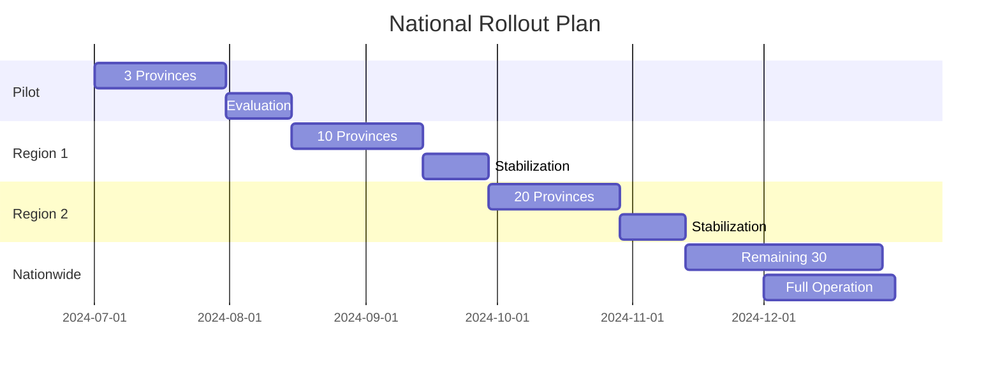

# Product Requirements Document (PRD)
## Hệ Thống Quản Lý Thủ Tục Hành Chính Quốc Gia

**Version:** 1.0  
**Ngày tạo:** 20/12/2024  
**Người tạo:** System Architecture Team  
**Trạng thái:** Draft

---

## 1. Tổng Quan Dự Án

### 1.1 Tóm Tắt Executive

Xây dựng hệ thống quản lý thủ tục hành chính nội bộ cấp quốc gia, số hóa toàn bộ quy trình xử lý, phê duyệt và trả kết quả hồ sơ hành chính cho cán bộ công chức. Hệ thống phục vụ 63 tỉnh/thành phố với khả năng xử lý 800.000 hồ sơ/tháng và hỗ trợ 25.000-30.000 cán bộ công chức với 18.000-21.000 người dùng đồng thời.

### 1.2 Mục Tiêu Dự Án

| Mục tiêu | Mô tả | KPI |
|----------|-------|-----|
| **Số hóa quy trình** | Chuyển đổi 100% thủ tục hành chính sang xử lý điện tử nội bộ | 2000 thủ tục được số hóa |
| **Tăng hiệu quả** | Giảm thời gian xử lý và tăng tính minh bạch trong nội bộ | Giảm 50% thời gian xử lý |
| **Cải thiện năng suất** | Cán bộ công chức xử lý hồ sơ hiệu quả hơn | 90% cán bộ hài lòng |
| **Tích hợp liên thông** | Kết nối các cấp chính quyền và LGSP | 100% đơn vị kết nối |

### 1.3 Phạm Vi Dự Án

**Trong phạm vi:**
- Quản lý 2000 thủ tục hành chính với 200-300 quy trình workflow khác nhau
- Hệ thống phân quyền đa cấp (Tỉnh → Sở/Ban/Ngành → Phường/Xã → Phòng ban)
- Tích hợp chữ ký số Ban Cơ yếu Chính phủ
- **Tích hợp Bưu chính công ích:** API gửi/nhận, tracking vận đơn, quản lý địa chỉ
- Workflow engine hỗ trợ cấu hình động
- Notification real-time và tracking hồ sơ
- Báo cáo thống kê đa chiều

**Ngoài phạm vi:**
- Portal nộp hồ sơ trực tuyến cho công dân (hệ thống riêng)
- Mobile application (Phase 2)
- Tích hợp thanh toán trực tuyến (Phase 2)
- AI/ML cho dự đoán và tự động hóa (Phase 3)

**Lưu ý quan trọng:**
- Đây là hệ thống nội bộ cho cán bộ công chức xử lý hồ sơ
- Công dân nộp hồ sơ qua: nộp trực tiếp, **Bưu chính công ích**, hoặc portal riêng biệt
- Kết quả trả cho công dân qua: nhận trực tiếp, **Bưu chính công ích**, hoặc portal tra cứu riêng
- **Tích hợp Bưu chính công ích:** Quản lý gửi/nhận qua chuyển phát, tracking vận đơn

### 1.4 Stakeholders

| Stakeholder | Vai trò | Mối quan tâm chính |
|------------|---------|-------------------|
| **Chính phủ** | Sponsor | ROI, hiệu quả quản lý nhà nước |
| **Cán bộ công chức** | Primary User | Dễ sử dụng, giảm khối lượng công việc, xử lý nhanh |
| **Lãnh đạo các cấp** | Decision Maker | Báo cáo, giám sát, ra quyết định |
| **Bộ phận IT** | Maintainer | Dễ vận hành, bảo trì |
| **Công dân** | Beneficiary | Nhận được dịch vụ nhanh hơn (gián tiếp) |

---

## 2. Yêu Cầu Chức Năng

### 2.1 Quản Lý Người Dùng và Phân Quyền

#### 2.1.1 Quản Lý Người Dùng

**Mô tả:** Quản lý thông tin người dùng đa cấp, đa đơn vị

**Acceptance Criteria:**
- [ ] Tạo/sửa/xóa người dùng với thông tin: họ tên, email, số điện thoại, chức vụ, đơn vị
- [ ] Một người dùng có thể thuộc nhiều đơn vị, phòng ban
- [ ] Import/export danh sách người dùng từ Excel
- [ ] Đồng bộ với LDAP/Active Directory nếu có

**User Stories:**
```
As an Admin
I want to manage user accounts across multiple departments
So that I can control system access efficiently
```

#### 2.1.2 Hệ Thống Phân Quyền (RBAC)

**Mô tả:** Phân quyền linh hoạt theo vai trò

**Vai trò chính:**
- **Tiếp nhận:** Nhận hồ sơ, kiểm tra tính hợp lệ
- **Thụ lý:** Xử lý chuyên môn hồ sơ
- **Lãnh đạo:** Phê duyệt, từ chối, yêu cầu bổ sung
- **Trả kết quả:** Hoàn tất hồ sơ và chuẩn bị trả kết quả

**Acceptance Criteria:**
- [ ] Gán nhiều vai trò cho một người dùng
- [ ] Phân quyền theo lĩnh vực (optional theo từng thủ tục)
- [ ] Ủy quyền có thời hạn với approval workflow
- [ ] Audit trail cho mọi thay đổi quyền

#### 2.1.3 Ủy Quyền Xử Lý

**Mô tả:** Cho phép ủy quyền xử lý hồ sơ trong khoảng thời gian nhất định

**Acceptance Criteria:**
- [ ] Tạo ủy quyền với thời gian bắt đầu/kết thúc
- [ ] Yêu cầu phê duyệt từ cấp trên
- [ ] Cả người ủy quyền và được ủy quyền đều có thể xử lý
- [ ] Tự động thu hồi quyền khi hết hạn

### 2.2 Workflow Engine

#### 2.2.1 Thiết Kế Workflow

**Mô tả:** Công cụ thiết kế quy trình xử lý hồ sơ

**Features:**
- **Visual Designer:** Giao diện kéo thả để thiết kế workflow
- **Excel Import:** Import workflow từ template Excel
- **Version Control:** Quản lý phiên bản workflow

**Acceptance Criteria:**
- [ ] Drag-drop interface cho non-technical users
- [ ] Định nghĩa các bước: tên, thời gian xử lý (giờ), vai trò, điều kiện
- [ ] Hỗ trợ sequential, parallel, conditional flows
- [ ] Sub-workflow và nested workflow
- [ ] Preview và validate workflow trước khi publish

#### 2.2.2 Cấu Hình Workflow Động

**Mô tả:** Thay đổi workflow cho hồ sơ đang xử lý

**Acceptance Criteria:**
- [ ] Option để apply workflow mới cho hồ sơ existing
- [ ] Migrate state an toàn khi chuyển workflow version
- [ ] Rollback capability nếu có lỗi
- [ ] Notification cho users affected

#### 2.2.3 Xử Lý Liên Thông

**Mô tả:** Workflow xử lý giữa các đơn vị, cấp

**Acceptance Criteria:**
- [ ] Chuyển hồ sơ lên cấp trên/xuống cấp dưới
- [ ] Xin ý kiến song song từ nhiều phòng ban
- [ ] Consolidate ý kiến trước khi quyết định
- [ ] Track status của từng luồng xử lý

### 2.3 Quản Lý Hồ Sơ

#### 2.3.1 Tiếp Nhận Hồ Sơ

**Mô tả:** Module tiếp nhận và số hóa hồ sơ (từ nộp trực tiếp, **Bưu chính công ích**, hoặc hệ thống khác)

**Acceptance Criteria:**
- [ ] Tạo mã hồ sơ: `[MaDonVi]-[yyyyMMdd]-[5 số sequence]`
- [ ] Scan và upload multiple files (PDF, Word, Excel, Image)
- [ ] **Nhận hồ sơ từ Bưu chính công ích với mã vận đơn**
- [ ] **Xác nhận nhận hàng và cập nhật trạng thái**
- [ ] Giới hạn 50-100MB/file
- [ ] Nhập thông tin cơ bản từ hồ sơ giấy
- [ ] Validate hồ sơ theo yêu cầu thủ tục
- [ ] Gán hồ sơ vào workflow xử lý

#### 2.3.2 Xử Lý Hồ Sơ

**Mô tả:** Luân chuyển và xử lý hồ sơ theo workflow

**Acceptance Criteria:**
- [ ] Xử lý theo workflow đã định nghĩa
- [ ] Attach file bổ sung ở mọi bước
- [ ] Nhập ý kiến xử lý/lý do từ chối
- [ ] Tính deadline theo ngày làm việc hoặc calendar
- [ ] Cảnh báo khi gần hết hạn (1 giờ trước)

#### 2.3.3 Ký Số Văn Bản

**Mô tả:** Tích hợp chữ ký số USB Token Ban Cơ yếu

**Acceptance Criteria:**
- [ ] Convert non-PDF files sang PDF
- [ ] Ký số với USB Token
- [ ] Visible signature với timestamp
- [ ] Lưu file gốc và file đã ký riêng biệt
- [ ] Verify chữ ký số

#### 2.3.4 Trả Kết Quả

**Mô tả:** Hoàn tất và trả kết quả cho công dân

**Acceptance Criteria:**
- [ ] Generate kết quả từ template
- [ ] Đính kèm các văn bản đã ký
- [ ] **Tạo vận đơn gửi qua Bưu chính công ích**
- [ ] **In địa chỉ và tem bưu điện**
- [ ] Gửi notification (SMS/Email) kèm mã tracking
- [ ] Cập nhật trạng thái "Đã hoàn thành"
- [ ] **Theo dõi trạng thái giao hàng**

### 2.4 Theo Dõi và Quản Lý Hồ Sơ

#### 2.4.1 Dashboard Cán Bộ

**Mô tả:** Màn hình làm việc cho cán bộ

**Views:**
- **Hồ sơ chờ xử lý:** Danh sách hồ sơ được giao
- **Hồ sơ đang xử lý:** Hồ sơ đang trong quá trình
- **Hồ sơ quá hạn:** Cảnh báo hồ sơ trễ deadline
- **Hồ sơ hoàn thành:** Lịch sử xử lý

**Acceptance Criteria:**
- [ ] Filter theo: ngày nộp, mã hồ sơ, trạng thái
- [ ] Sort theo độ ưu tiên, deadline
- [ ] Bulk actions cho multiple hồ sơ
- [ ] Export danh sách Excel

### 2.5 Notification System

#### 2.5.1 Real-time Notifications

**Mô tả:** Thông báo tức thời trên web

**Trigger Events:**
- Hồ sơ mới được chuyển đến
- Hồ sơ sắp hết hạn (1 giờ)
- Hồ sơ bị trả lại
- Yêu cầu ủy quyền được duyệt

**Acceptance Criteria:**
- [ ] Push notification trên browser
- [ ] Badge counter cho unread notifications
- [ ] Notification center với history
- [ ] Mark as read/unread

#### 2.5.2 External Notifications

**Mô tả:** Thông báo qua SMS/Email

**Acceptance Criteria:**
- [ ] Template-based messages
- [ ] Merge data vào template
- [ ] Queue để tránh overload
- [ ] Retry mechanism cho failed messages
- [ ] Delivery tracking

### 2.6 Báo Cáo và Thống Kê

#### 2.6.1 Báo Cáo Định Kỳ

**Mô tả:** Các báo cáo theo lịch

**Loại báo cáo:**
- Tiến độ xử lý theo đơn vị
- Thống kê theo thủ tục
- Báo cáo hiệu suất cán bộ
- Tỷ lệ đúng/trễ hạn

**Acceptance Criteria:**
- [ ] Báo cáo theo: ngày, tuần, tháng, quý, năm
- [ ] Filter theo đơn vị, phòng ban
- [ ] Export Word/Excel
- [ ] Schedule auto-generate và gửi email

#### 2.6.2 Real-time Analytics

**Mô tả:** Dashboard phân tích real-time

**Metrics:**
- Số hồ sơ theo trạng thái
- Thời gian xử lý trung bình
- Bottlenecks trong workflow
- Trending thủ tục

**Acceptance Criteria:**
- [ ] Update mỗi 1-2 phút
- [ ] Drill-down capability
- [ ] Visual charts và graphs
- [ ] Responsive cho mọi devices

### 2.7 Tích Hợp Hệ Thống

#### 2.7.1 LGSP Integration

**Mô tả:** Kết nối với Local Government Service Platform

**Acceptance Criteria:**
- [ ] REST API integration
- [ ] Authentication với OAuth2/JWT
- [ ] Sync master data
- [ ] Submit hồ sơ liên thông

#### 2.7.2 SMS Gateway

**Mô tả:** Tích hợp gửi SMS

**Acceptance Criteria:**
- [ ] REST API với providers trong nước
- [ ] Bulk SMS capability
- [ ] Delivery report tracking
- [ ] Fallback to secondary provider

#### 2.7.3 Bưu chính công ích Integration

**Mô tả:** Tích hợp với hệ thống Bưu chính công ích để gửi/nhận hồ sơ và kết quả

**Acceptance Criteria:**
- [ ] API tích hợp với VietnamPost/EMS
- [ ] Tạo vận đơn chuyển phát tự động
- [ ] Tracking trạng thái gửi/nhận real-time
- [ ] Quản lý địa chỉ người nhận
- [ ] Tính cước phí tự động

---

### 2.8 Background Service Architecture

#### 2.8.1 Message Queue Based Processing

**Mô tả:** Tất cả tích hợp ngoại vi (SMS, Email, Postal, LGSP) phải chạy dưới dạng background services consuming từ RabbitMQ

**Architecture Pattern:**
```
API Request → Publish to RabbitMQ → Return immediately
Background Worker → Consume message → Process → Update status
```

**Core Benefits:**
- **Decoupling:** API không phụ thuộc availability của external services
- **Reliability:** Messages được persist trong queue
- **Scalability:** Workers scale độc lập theo load
- **Performance:** API response < 100ms

#### 2.8.2 Worker Services Requirements

**Notification Worker Service:**
- [ ] Email processing với template engine
- [ ] SMS gateway với provider rotation
- [ ] Priority queue (1=urgent, 5=low)
- [ ] Retry logic: 3 attempts với exponential backoff
- [ ] Dead letter queue cho permanent failures

**Postal Worker Service:**
- [ ] VietnamPost/EMS API integration
- [ ] Shipment creation và tracking updates
- [ ] Webhook callbacks từ postal providers
- [ ] Address validation và cost calculation

**LGSP Sync Worker Service:**
- [ ] Procedure catalog synchronization
- [ ] Document submission và status updates
- [ ] Fallback to cached data khi LGSP unavailable
- [ ] Batch processing cho bulk operations

**Message Queues:**
```
- notification.email.queue (priority enabled)
- notification.sms.queue (priority enabled)
- postal.shipment.queue
- postal.tracking.queue
- lgsp.sync.queue
- lgsp.submit.queue
- retry.exchange (cho failed messages)
- dlq.exchange (dead letter queue)
```

#### 2.8.3 Monitoring và Health Checks

**Acceptance Criteria:**
- [ ] Queue depth monitoring với alerts
- [ ] Processing rate metrics (messages/second)
- [ ] Worker health checks và auto-restart
- [ ] Dead letter queue dashboard
- [ ] Integration status dashboard

---

## 3. Yêu Cầu Phi Chức Năng

### 3.1 Performance Requirements

| Metric | Target | Measurement Method |
|--------|--------|-------------------|
| **Response Time** | <100ms cho write operations | 95th percentile |
| **Read Latency** | <50ms cho cached queries | Average |
| **Search Time** | <200ms full-text search | 95th percentile |
| **Concurrent Users** | 18,000-21,000 | Peak load |
| **Throughput** | 270 hồ sơ/giây peak | Load testing |
| **Page Load** | <2 giây | Google PageSpeed |

### 3.2 Availability & Reliability

| Requirement | Target | Notes |
|------------|--------|-------|
| **Uptime** | 99.9% | 43.8 phút downtime/tháng |
| **MTBF** | >720 giờ | Mean Time Between Failures |
| **MTTR** | <1 giờ | Mean Time To Repair |
| **Data Durability** | 99.999999999% | 11 nines với erasure coding |
| **Backup** | Daily full, hourly incremental | 30 days retention |

### 3.3 Security Requirements

| Category | Requirements |
|----------|-------------|
| **Authentication** | Multi-factor authentication, PKI certificate support |
| **Authorization** | RBAC với temporal permissions |
| **Encryption** | TLS 1.3 in transit, AES-256 at rest |
| **Audit** | Comprehensive logging của mọi actions |
| **Compliance** | ISO 27001, Vietnam cybersecurity law |
| **Session** | Timeout sau 30 phút inactive |

### 3.4 Scalability Requirements

| Dimension | Current | Future (3 years) |
|-----------|---------|-----------------|
| **Users** | 25,000 | 50,000 |
| **Concurrent** | 21,000 | 40,000 |
| **Documents/month** | 800,000 | 2,000,000 |
| **Storage** | 200TB | 500TB |
| **Provinces** | 63 | 63 |

### 3.5 Usability Requirements

- **Responsive Design:** Hoạt động trên mọi thiết bị (desktop, tablet, mobile)
- **Browser Support:** Chrome, Firefox, Safari, Edge (2 versions gần nhất)
- **Page Navigation:** Không quá 3 clicks để đến chức năng chính
- **Error Messages:** Clear, actionable error messages tiếng Việt
- **Help System:** Context-sensitive help và user manual

### 3.6 Compatibility Requirements

- **Database:** SQL Server 2019+
- **OS:** Windows Server 2019+, Ubuntu 20.04+
- **Framework:** .NET 8+
- **Browser:** Modern browsers với JavaScript enabled
- **File Formats:** PDF, DOCX, XLSX, JPG, PNG

---

## 4. Kiến Trúc Hệ Thống

### 4.1 High-Level Architecture

```
┌─────────────────────────────────────────────────────────┐
│                    Load Balancer (HAProxy)               │
└─────────────────────────────────────────────────────────┘
                            │
        ┌───────────────────┴───────────────────┐
        │                                       │
┌───────▼────────┐                    ┌────────▼────────┐
│  Web Frontend  │                    │   API Gateway   │
│   (NextJS)     │                    │     (YARP)      │
└────────────────┘                    └────────┬────────┘
                                               │
                    ┌──────────────────────────┼──────────────────────────┐
                    │                          │                          │
         ┌──────────▼─────────┐    ┌──────────▼─────────┐    ┌──────────▼─────────┐
         │   User Service     │    │  Workflow Service   │    │  Document Service  │
         │   (.NET 8)         │    │   (Elsa + .NET 8)  │    │    (.NET 8)       │
         └──────────┬─────────┘    └──────────┬─────────┘    └──────────┬─────────┘
                    │                          │                          │
         ┌──────────▼──────────────────────────▼──────────────────────────▼─────────┐
         │                         Message Queue (RabbitMQ)                         │
         └───────────────────────────────────────────────────────────────────────────┘
                    │                          │                          │
         ┌──────────▼─────────┐    ┌──────────▼─────────┐    ┌──────────▼─────────┐
         │   SQL Server       │    │     Redis Cache     │    │   MinIO Storage    │
         │    (CQRS)          │    │                     │    │    (S3)            │
         └────────────────────┘    └─────────────────────┘    └────────────────────┘
```

### 4.2 Technology Stack

| Layer | Technology | Justification |
|-------|------------|---------------|
| **Frontend** | NextJS 14, TypeScript | SSR, SEO, performance |
| **API Gateway** | YARP | Native .NET integration |
| **Backend** | .NET 8, EF Core 8 | Performance, ecosystem |
| **Workflow** | Elsa Workflows 3.0 | .NET native, visual designer |
| **Message Queue** | RabbitMQ | Reliability, .NET support |
| **Database** | SQL Server 2022 | Enterprise features, CQRS |
| **Cache** | Redis Enterprise | Performance, clustering |
| **Storage** | MinIO | S3-compatible, on-premise |
| **Search** | Elasticsearch 8 | Full-text search, analytics |

### 4.3 Deployment Architecture

```yaml
National Deployment:
  Central Services:
    - Location: Hanoi DC
    - Services: Auth, Master Data, Monitoring
    
  Regional Clusters (3):
    North Region:
      - Location: Hanoi
      - Coverage: 25 provinces
      - Capacity: 7k concurrent users
      
    Central Region:
      - Location: Da Nang
      - Coverage: 18 provinces
      - Capacity: 5k concurrent users
      
    South Region:
      - Location: Ho Chi Minh
      - Coverage: 20 provinces
      - Capacity: 9k concurrent users
      
  Database Strategy:
    - Primary: Read/Write cluster per region
    - Replicas: 2-3 read replicas per region
    - Sharding: By province_id
```

### 4.4 Progressive Complexity Strategy

#### 4.4.1 Philosophy: Start Simple, Scale Smart

**Core Principle:**
Build a progressively scalable architecture that grows with actual usage patterns while maintaining all functional requirements through intelligent design rather than brute force infrastructure.

**Anti-Over-Engineering Approach:**
- Implement minimum viable complexity to meet requirements
- Add sophistication only when proven necessary by real usage data
- Maintain fallback to simpler modes at all times
- Prioritize reliability over theoretical scalability

#### 4.4.2 Hybrid User Connection Model

**Challenge:** 21,000 concurrent users with real-time requirements is extremely ambitious and expensive.

**Smart Solution: Adaptive Connection Strategy**

```yaml
User Segmentation by Activity Level:
  Tier 1 - Active Users (Real-time):
    Count: 3,000-5,000 concurrent
    Technology: SignalR WebSockets
    Users: Document processors, approvers, workflow handlers
    Update Frequency: Instant

  Tier 2 - Semi-Active Users (Near Real-time):
    Count: 10,000-15,000 concurrent
    Technology: Server-Sent Events + Smart Polling
    Users: Supervisors, managers, document viewers
    Update Frequency: 5-30 seconds

  Tier 3 - Passive Users (Eventual):
    Count: Remaining users (3,000-7,000)
    Technology: Background sync + Push notifications
    Users: Report viewers, auditors, occasional users
    Update Frequency: 30-300 seconds
```

**Benefits:**
- **70% Infrastructure Reduction**: Only 5,000 real-time connections vs 21,000
- **Same User Experience**: Users get updates appropriate to their work patterns
- **Automatic Tier Switching**: Users move between tiers based on activity
- **Graceful Degradation**: System never fully fails, just reduces update frequency

#### 4.4.3 Simplified Regional Architecture

**Challenge:** 3 regional clusters with full replication adds operational complexity.

**Smart Solution: Primary + Cache Nodes Architecture**

```yaml
Regional Strategy:
  Primary Data Center (Hanoi):
    - All write operations (100%)
    - Master database with Always On
    - Complete application stack
    - Handles: 270 documents/second

  Regional Performance Nodes:
    North: Hanoi (Primary location)
    Central: Da Nang (Cache + CDN only)
    South: Ho Chi Minh (Cache + CDN only)

  Data Strategy:
    Writes: Always to primary (ensure consistency)
    Reads:
      - Cached data from nearest node (80% of reads)
      - Fresh data from primary (20% of reads)
      - Automatic cache warming

  Fallback: If regional cache fails, route to primary
```

**Benefits:**
- **50% Operational Complexity Reduction**: No complex data synchronization
- **Same Performance**: <100ms response through smart caching
- **Data Consistency**: Single source of truth eliminates sync issues
- **Cost Effective**: 60% infrastructure cost reduction vs full replication

#### 4.4.4 Progressive External Service Degradation

**Challenge:** Heavy dependency on LGSP, SMS providers, Vietnam Post creates failure risks.

**Smart Solution: Layered Service Availability**

```yaml
Service Availability Levels:

Level 1 - Full Online Mode (Target: 95% uptime):
  LGSP: Direct real-time API calls
  SMS: Primary provider with immediate delivery
  Postal: Real-time tracking updates
  User Experience: Optimal with instant validation

Level 2 - Cached Mode (Graceful degradation):
  LGSP: Use cached data (up to 7 days old) + queue fresh requests
  SMS: Secondary providers + delivery queue
  Postal: Estimated tracking + manual verification
  User Experience: Slightly delayed but fully functional

Level 3 - Offline Mode (Emergency fallback):
  LGSP: Local validation rules + manual verification queue
  SMS: Email fallback + paper notification backup
  Postal: Manual tracking entry + phone verification
  User Experience: Paper-based workflow simulation
```

**Implementation Strategy:**
```yaml
Auto-Detection & Switching:
  Monitor external API health every 30 seconds
  Switch to degraded mode if failure rate > 30%
  Automatic recovery when services restore
  User notification of current mode

Cache Strategy:
  LGSP Data: 30-day rolling cache with freshness indicators
  SMS Templates: Pre-rendered for offline delivery
  Postal Codes: Complete offline database

Queue Management:
  Failed requests automatically queued for retry
  Manual intervention queue for offline mode
  Priority processing when services restore
```

#### 4.4.5 Intelligent Performance Scaling

**Challenge:** Performance targets must be met without over-provisioning.

**Smart Solution: Predictive Performance Tiers**

```yaml
Performance Optimization by Criticality:

Tier 1 - Critical Path (Heavy optimization):
  Operations: Login, document search, status updates
  Target: <50ms response time
  Techniques: Memory caching, covering indexes, read replicas
  Resources: 40% of infrastructure budget

Tier 2 - Interactive (Moderate optimization):
  Operations: Document creation, workflow transitions, reports
  Target: <200ms response time
  Techniques: Query optimization, selective caching
  Resources: 40% of infrastructure budget

Tier 3 - Background (Basic optimization):
  Operations: Notifications, sync, audit logging
  Target: <2000ms response time
  Techniques: Async processing, batch operations
  Resources: 20% of infrastructure budget
```

**Adaptive Scaling Logic:**
```yaml
Scaling Triggers:
  End-of-month patterns: Pre-scale 48 hours before
  External API failures: Auto-enable cache mode
  High error rates: Activate circuit breakers
  Resource pressure: Selective feature degradation

Scaling Actions:
  Scale Up: Add instances for specific services
  Scale Out: Enable additional cache regions
  Scale Down: Reduce features gracefully
  Scale Smart: Switch to more efficient algorithms
```

#### 4.4.6 Implementation Phases with Risk Mitigation

**Revised Phase Strategy:**

```yaml
Phase 1 (Months 1-3) - Proven Foundation:
  Scope: Core CRUD + simple workflows + basic auth
  Users: 5,000 concurrent (single tier)
  Technology: Repository pattern, basic caching
  Risk: Low (proven patterns only)
  Success Criteria: Handles 100 documents/second reliably

Phase 2 (Months 4-6) - Smart Scaling:
  Scope: Add user tiers + queue system + external API integration
  Users: 10,000 concurrent (2 tiers)
  Technology: Add message queues, circuit breakers
  Risk: Medium (add complexity gradually)
  Success Criteria: Handles 200 documents/second with degradation

Phase 3 (Months 7-9) - Advanced Features:
  Scope: Full workflow engine + regional caching + analytics
  Users: 15,000 concurrent (3 tiers)
  Technology: Complex workflows, materialized views
  Risk: Medium-High (monitor performance closely)
  Success Criteria: Handles 270 documents/second target load

Phase 4 (Months 10-12) - Optimization & Scale:
  Scope: Performance tuning + full monitoring + edge cases
  Users: 21,000 concurrent (full hybrid model)
  Technology: Full optimization suite
  Risk: Controlled (proven foundation)
  Success Criteria: Meet all NFRs with 99.9% uptime
```

#### 4.4.7 Fail-Safe Guarantees

**Core Guarantees:**
1. **Never Fully Offline**: System degrades gracefully, never completely fails
2. **Data Safety**: All data writes go to primary DB - no data loss possible
3. **User Notification**: Clear indicators of current system capability level
4. **Manual Fallback**: Paper-based processes documented and ready
5. **Quick Recovery**: Automatic restoration when services return

**Monitoring & Alerting:**
```yaml
Real-time Dashboards:
  System Health: Current degradation level across all services
  Performance Metrics: Response times by tier and operation
  User Experience: Actual user satisfaction scores
  External Dependencies: Status of LGSP, SMS, Postal APIs

Automated Alerts:
  Level 1: Performance degradation (warn stakeholders)
  Level 2: Service degradation (activate backup plans)
  Level 3: Emergency mode (manual intervention required)
```

---

## 5. Kế Hoạch Triển Khai

### 5.1 Development Phases

| Phase | Duration | Deliverables | Success Criteria |
|-------|----------|--------------|------------------|
| **Phase 1: Foundation** | 8 weeks | Core services, basic workflow, RBAC | All unit tests pass |
| **Phase 2: Workflow Engine** | 8 weeks | Visual designer, workflow execution | 10 workflows tested |
| **Phase 3: Integration** | 6 weeks | LGSP, SMS, Digital signature | End-to-end flow works |
| **Phase 4: Portal & UI** | 6 weeks | Citizen portal, admin dashboard | Usability testing passed |
| **Phase 5: Testing** | 4 weeks | Load testing, security audit | Meet all NFRs |
| **Phase 6: Pilot** | 4 weeks | Deploy to 3 provinces | 500 real transactions |

### 5.2 Rollout Strategy



### 5.3 Risk Management

| Risk | Impact | Probability | Mitigation |
|------|--------|-------------|------------|
| **Performance degradation** | High | Medium | Caching strategy, load testing |
| **Data migration issues** | High | Low | Phased migration, rollback plan |
| **User adoption** | High | Medium | Training program, change management |
| **Integration failures** | Medium | Medium | Mock services, circuit breakers |
| **Security breaches** | High | Low | Security audit, penetration testing |

---

## 6. Success Metrics

### 6.1 Business KPIs

| KPI | Current | Target (Year 1) | Target (Year 3) |
|-----|---------|-----------------|-----------------|
| **Digital Adoption Rate** | 0% | 70% | 95% |
| **Processing Time Reduction** | Baseline | -30% | -50% |
| **Citizen Satisfaction** | 60% | 80% | 90% |
| **Cost per Transaction** | 50,000 VND | 20,000 VND | 10,000 VND |
| **On-time Completion Rate** | 70% | 85% | 95% |

### 6.2 Technical KPIs

| KPI | Target | Measurement |
|-----|--------|-------------|
| **System Availability** | 99.9% | Monitoring tools |
| **API Response Time** | <100ms | APM tools |
| **Concurrent User Support** | 21,000 | Load testing |
| **Data Processing Rate** | 270 docs/sec | Throughput monitoring |
| **Error Rate** | <0.1% | Error tracking |

### 6.3 Operational KPIs

| KPI | Target | Measurement |
|-----|--------|-------------|
| **Deployment Frequency** | Weekly | CI/CD pipeline |
| **MTTR** | <1 hour | Incident tracking |
| **Change Failure Rate** | <5% | Deployment logs |
| **Backup Success Rate** | 100% | Backup monitoring |
| **Security Incident Rate** | 0 critical | SIEM |

---

## 8. Approval and Sign-off

| Role | Name | Signature | Date |
|------|------|-----------|------|
| **Project Sponsor** | | | |
| **Technical Lead** | | | |
| **Business Owner** | | | |
| **Security Officer** | | | |
| **Finance Director** | | | |

---

## 9. Appendices

### Appendix A: Glossary

| Term | Definition |
|------|------------|
| **LGSP** | Local Government Service Platform |
| **RBAC** | Role-Based Access Control |
| **CQRS** | Command Query Responsibility Segregation |
| **NFR** | Non-Functional Requirements |
| **SLA** | Service Level Agreement |
| **MTBF** | Mean Time Between Failures |
| **MTTR** | Mean Time To Repair |

### Appendix B: References

1. Vietnam E-Government Architecture Framework 2.0
2. ISO/IEC 27001:2022 Information Security Standard
3. Government Decree on Digital Transformation
4. National Public Service Portal Integration Guidelines

### Appendix C: Assumptions and Dependencies

**Assumptions:**
- Stable internet connectivity nationwide
- Users have basic computer literacy
- Government support throughout implementation
- No major legal/regulatory changes

**Dependencies:**
- LGSP APIs availability
- Digital signature infrastructure ready
- Provincial IT teams cooperation
- Budget approval on schedule

### Appendix D: Change Log

| Version | Date | Changes | Author |
|---------|------|---------|--------|
| 0.1 | 2024-12-20 | Initial draft | System Architect |
| 1.0 | 2024-12-20 | Complete PRD | Team |

---

**END OF DOCUMENT**